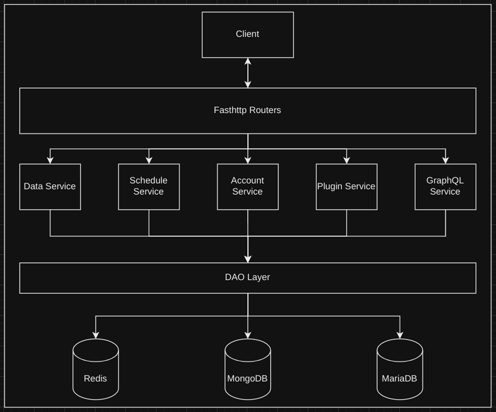

# Upgraded Disco

This repository hosts the backend for my [website](https://ssnk.in). It is written in Go, and code has been organized
based on hexagonal architecture. The application uses MariaDB, MongoDB and Redis.

## Components & Architecture

It is a fairly simple, but evolving application, but the high level flow looks like this:

The services like Data, Schedule, Account et ce-tera are not microservices as of now, but Go packages that implement the
generalised Service interface in the [ports package](./internal/ports).

Here's a brief description of the services:

- Account Service: Facilitate account management services like register, login, update and delete account, session
  management et ce-tera.
- Data Service: Facilitate data fetching(might extend to perform other tasks).
- Schedule Service: Facilitate calendar blocking based on availability(might involve in-house SMTP server).
- Plugin Service: Facilitate running scripts/integrations as plugin(will be language and task agnostic).
- GraphQL Service: Currently not under development.

## Project Setup and Deployment

This project uses docker-compose for deployment. You can follow the [DEPLOY.md](./DEPLOY.md) file for instructions.

## License

This project is licensed under the [MIT License](./LICENSE). Feel free to fork it and use as a starting point. You can also open an issues and contribute directly to this code base. Thank you in advance🙂!
